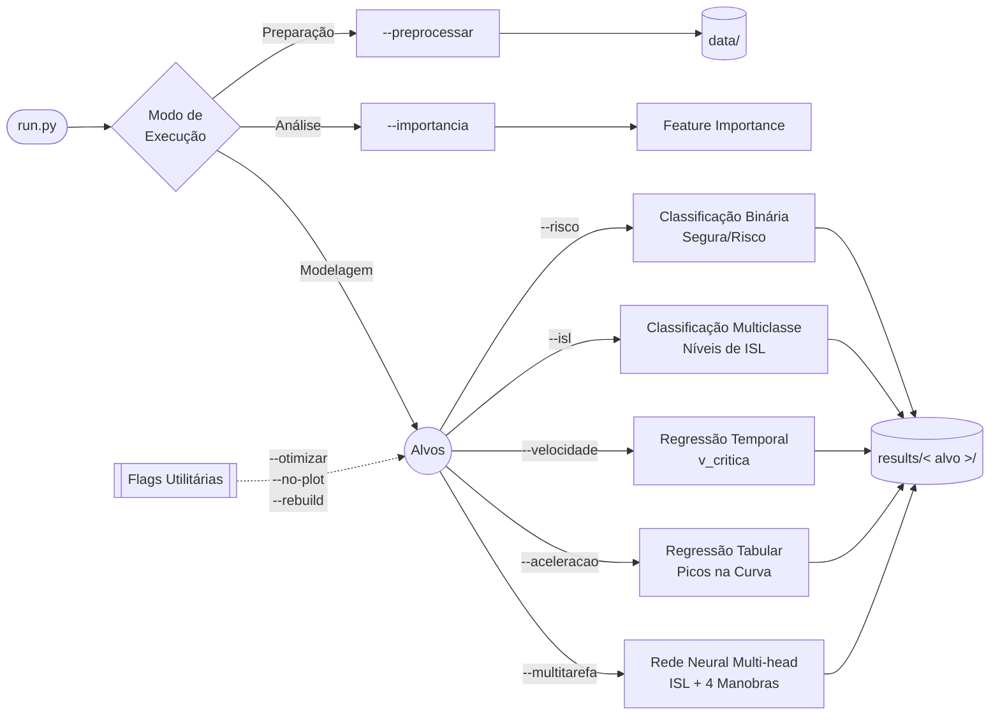
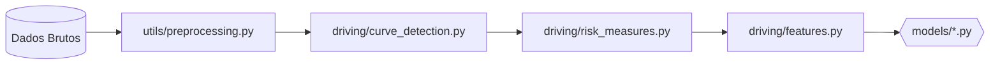

<p align="center">
  
</p>

<p align="center">
  
  
  
  
  
  <a href="https://huggingface.co/datasets/jwsouza13/routes_ML_inmetro">
    
  </a>
</p>

Queremos prever, momentos antes de o motorista entrar numa curva, se ele realizará uma condução segura ou de risco, a partir de dados de sensores veiculares OBD Link. Todas as features saem de uma janela antes da curva, e a janela termina com uma folga (`lead_gap`, 30 m) da entrada.

## Instalação e execução
Clone este repositório:

```bash
git clone https://github.com/josewilsonsouza/curvant-ml.git
cd curvant-ml
```
Então execute a instalação:

```powershell
pip install -e .
```

Agora execute a limpeza dos dados definida pelo framework, executando

```powershell
python run.py --preprocessar
```

Implementamos algumas variáveis que são de interesse prever antes de entrar na curva. As flags de **predição** abaixo escolhem o que prever; cada uma escreve seus resultados em `results/<alvo>/`. Sem flag, o `run.py` mostra a ajuda.

```powershell
# Predição — cada flag escolhe um alvo
python run.py --risco          # classifica a condução na curva em Segura/Risco
python run.py --isl            # classifica o ISL (3 classes) + baseline físico
python run.py --velocidade     # prevê a velocidade crítica e deriva o ISL
python run.py --aceleracao     # regressão das acelerações dentro da curva
python run.py --multitarefa    # MLP PyTorch: ISL + manobras juntos
```

Os comandos abaixo **não** são predição: um inspeciona o modelo e os outros são modificadores/utilidades, combináveis com as flags de predição.

```powershell
# Análise (não prevê, inspeciona)
python run.py --importancia            # importância das features (XGBoost)

# Modificadores e utilidades (combináveis com as flags de predição)
python run.py --risco --otimizar       # + ajuste de hiperparâmetros (Optuna)
python run.py --velocidade --rebuild   # ignora o cache e reprocessa as etapas 1–5
python run.py --isl --no-plot          # pula os gráficos (mais rápido)
```

> **📝Nota**. Use `--rebuild` ao mudar parâmetros do `config.yaml` que afetam detecção ou extração de features.

As flags acima preveem o seguinte

| Flag | Alvo/Target | Tipo |
|---|---|---|
| `--risco` | curva Segura/Risco (`manobra_combinado_curva`) | binário |
| `--isl` | classe de ISL (baixo/médio/alto) + baseline físico | 3 classes |
| `--velocidade` | velocidade crítica `v_critica` (e ISL derivado pela física) | regressão |
| `--aceleracao` | picos de aceleração dentro da curva | regressão |
| `--multitarefa` | `isl_max` + as 4 manobras, num modelo só | regressão + binários |

> **Direção atual do projeto:** o caminho mais promissor é o `--velocidade`: prever a velocidade crítica e calcular o ISL pela física. É onde o modelo supera de fato um chute simples (o erro cai de ~11 para ~7 km/h sobre o baseline de persistência).

A lista completa de alvos e das 49 features (agrupadas em F1–F5 + Monte Carlo), com o que cada coluna significa, está em **[TARGETS_E_FEATURES](docs/TARGETS_E_FEATURES.md)**.

Veja na imagem a seguir o fluxo de exeução das flags e os targets.



## Pipeline

O projeto segue o seguite pipeline.




### Janela pré-curva

As features saem de uma janela espacial logo antes da curva. O tamanho é fixo (`features.janela_distancia`, 50 m) ou dinâmico pela distância de frenagem de conforto `d = v̄²/(2·a_c)`, com clip em ` janela_distancia_min, janela_distancia_max]`. A janela termina `lead_gap` metros **antes** da entrada (predição antecipada) e exclui pontos de uma
curva anterior.

### Caracterização de risco (3 critérios)

Para cada segmento contíguo de `curva=True`, três critérios independentes geram os rótulos:

| Critério | Coluna | Definição |
|---|---|---|
| Limite de aderência (Kamm) | `manobra_accel_curva` | $\max_t \sqrt{a_x^2 + a_y^2} > \alpha\,\mu\,g$ |
| Aceleração lateral | `manobra_lateral_curva` | $\max_t \lvert a_y \rvert > 2{,}0$ e curva DNIT $\ge$ aberta |
| Zigue-zague | `manobra_ziguezague_curva` | $\ge 3$ mudanças de bearing alternadas com aceleração centrípeta |

`manobra_combinado_curva` é o OR dos três. Detalhes desses critérios estão em [RISK_MEASURES](docs/RISK_MEASURES.md).

## Modelos

- **Tabular** (`--risco`, `--isl`, `--aceleracao`): LogisticRegression, SVM, DecisionTree, RandomForest, XGBoost, MLP. Pipeline `SMOTE -> StandardScaler -> [PCA] -> modelo`, com split e  validação cruzada **por rota** (`GroupKFold`/`StratifiedGroupKFold`) para não vazar entre  gravações.
- **Optuna** (`--risco --otimizar`): tuning bayesiano de XGBoost, RandomForest e LogReg.
- **Temporais** (`--velocidade`): operam sobre a sequência bruta da janela pré-curva (não estatísticas). Modelos em `temporais.model`: `linear`, `rf`, `xgboost` (tabulares sobre estatísticas da sequência) e `mlp`, `lstm`, `gru`, `cnn1d` (neurais).
- **Multitarefa** (`--multitarefa`): MLP PyTorch com um encoder compartilhado e 5 heads.

Sob `--isl` e `--velocidade`, o pipeline reporta um baseline sem aprendizado ao lado dos modelos — a simulação de Monte Carlo (argmax para `isl_class`) e a persistência (`v_critica` ~ velocidade de aproximação). Serve para medir o quanto o ML realmente agrega.

## Configuração (`config.yaml`)

Tudo num arquivo só, com cada seção correspondendo a um módulo. As principais:

| Seção | Para que serve |
|---|---|
| `physics` | constantes do ISL: `mu` (atrito) e os limiares `isl_baixo`/`isl_alto` |
| `preprocessing` | limpeza dos dados brutos |
| `curve_detection` | B-spline, `limite_raio`, classes DNIT |
| `risk_measures` | limiares dos critérios de risco (Kamm, lateral, zigue-zague) |
| `features` | janela pré-curva, `lead_gap`, sensores |
| `montecarlo` | simulação de probabilidade de ISL |
| `ml` | parâmetros compartilhados dos modelos (split, CV, PCA, cap de outliers) |
| `optuna` | nº de trials do tuning |
| `multitarefa` | hiperparâmetros do MLP PyTorch |
| `temporais` | modelos, alvo e hiperparâmetros do `--velocidade` |

As constantes físicas (`g`, `μ`, limiares de ISL) ficam centralizadas em
[curvant/constants.py](curvant/constants.py), que lê `μ` e os limiares da seção `physics` do config.

## Dados

Dataset público no HuggingFace: [`jwsouza13/routes_ML_inmetro`](https://huggingface.co/datasets/jwsouza13/routes_ML_inmetro). Os dados foram coletados pela equipe Lainf do Inmetro.

| Conjunto | Veículo | Trecho | Local |
|---|---|---|---|
| ELETRONUCLEAR | Spin / Van | Rio de Janeiro | `eletronuclear` |
| RJ-DF | Nivus | Rio de Janeiro -> Brasília | `rjdf` |
| SERRA | Jetta | trecho serrano | `serra` |
| RJMGBA / JANEIRO | — | rotas adicionais | `rjmgba`, `janeiro` |