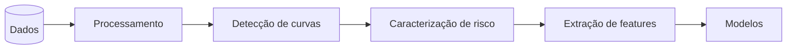

<p align="center">
  
</p>

<p align="center">
  
  
  
  
  
  <a href="https://huggingface.co/datasets/jwsouza13/routes_ML_inmetro">
    
  </a>
</p>

Queremos prever, momentos antes de o motorista entrar numa curva, se ele realizará uma condução segura ou de risco, a partir de dados de sensores veiculares OBD Link anteriores à curva.

## Instalação e execução
Clone este repositório:

```bash
git clone https://github.com/josewilsonsouza/curvant-ml.git
cd curvant-ml
```
Instalando:

```powershell
pip install -e .
```

Execute a limpeza dos dados, fazendo

```bash
cvt preprocess
```

## Uso

O comando tem **dois eixos**: a **representação** da entrada e o **alvo**.

```
cvt <repr> <alvo>
```

A **representação** decide o que o modelo enxerga de cada curva:

- **`tab`**: as features já agregadas por curva (um vetor de números: médias, máximos, jerk, geometria).
- **`seq`**: a série temporal bruta da janela pré-curva, reamostrada para um comprimento fixo (`config.yaml > temporais.n_timesteps`).

O **alvo** decide o que se prevê: `risk` (Segura ou Risco), `isl` (a faixa de ISL) ou `velocity` (a velocidade crítica).

Os dois eixos são independentes, então o mesmo alvo roda nas duas representações. É assim que se compara se a série bruta traz alguma coisa além das features agregadas:

|  | `risk` | `isl` | `velocity` |
|---|---|---|---|
| **`tab`** | `cvt tab risk` | `cvt tab isl` | `cvt tab velocity` |
| **`seq`** | `cvt seq risk` | `cvt seq isl` | `cvt seq velocity` |

Cada célula escreve em `results/<repr>/<alvo>/`. Sem subcomando, `cvt` mostra a ajuda.

```bash
cvt tab risk         # features agregadas -> Segura/Risco
cvt seq velocity     # série bruta        -> velocidade crítica (e a faixa de ISL junto)
cvt tab isl          # features agregadas -> faixa de ISL
```

No `cvt seq velocity`, o modelo prevê a velocidade **e** a faixa de ISL na mesma passada, por uma segunda cabeça de classificação (multitarefa). Assim a faixa é aprendida direto, em vez de sair de um corte por limiar sobre a velocidade prevista, que é o que degradava a classe perto das fronteiras.

Outros comandos úteis são:

```bash
cvt seq velocity --rebuild                # ignora o cache e reprocessa os dados
cvt seq velocity --no-plot                # pula geração de gráficos
cvt tab risk --data eletro_rjdf_serra     # roda sobre outro dataset
```
> [!TIP]
> Use `--rebuild` ao mudar parâmetros de detecção de curvas (`config.yaml`) ou de extração de features (`features.yaml > extracao`).

### Escolha do dataset

O dataset é escolhido nesta ordem: flag `--data` > campo `data.dataset` do `config.yaml` > auto-detecção do maior arquivo disponível em `data/`. O valor pode ser o nome do conjunto (`eletro_rjdf_serra`) ou um caminho, e a versão limpa (`_clean`) é preferida quando existir.

```yaml
# config.yaml
data:
  dataset: null   # null = auto-detecta; ou o nome, ex: eletro_rjdf_serra_rjmgba_janeiro_agda
```

Os resultados intermediários do pipeline são cacheados por dataset (`data/.cache_*_<nome>.parquet`), então alternar entre conjuntos não reprocessa nem mistura nada.

A mudança de parâmetros das configurações podem ser feitas no **`config.yaml`** e, para o gerenciamento das features, o arquivo **`features.yaml`**. A lista completa de targets e features está em **[TARGETS_E_FEATURES](docs/TARGETS_E_FEATURES.md)**.
## Pipeline

O projeto segue o seguinte pipeline.



As features saem de uma janela espacial logo antes da curva (`precurva_distancia`). O tamanho é fixo ou dinâmico pela distância de frenagem ideal,  `[precurva_distancia_min, precurva_distancia_max]`. A janela termina `lead_gap` metros **antes** da entrada (predição antecipada) e exclui pontos de uma curva anterior.

### Caracterização de risco

Para cada segmento contíguo de `curva=True`, três critérios independentes geram os rótulos:

| Critério | Definição |
|---|---|
| Limite de aderência| $\max_t \sqrt{a_x^2 + a_y^2} > \alpha\,\mu\,g$ |
| Aceleração lateral | $\max_t \lvert a_y \rvert > 2 $ e curva DNIT $\ge$ aberta |
| Zigue-zague | $\ge 3$ mudanças de bearing alternadas com aceleração centrípeta |

`manobra_combinado_curva` é o OR dos três. Detalhes desses critérios estão em [RISK_MEASURES](docs/RISK_MEASURES.md).

### Validação

O corte treino/teste é feito **por rota**, nunca por curva: todas as curvas de uma gravação ficam do mesmo lado, senão o modelo veria condições quase idênticas nos dois e a métrica ficaria inflada. O SMOTE roda só dentro do fold de treino, jamais na validação ou no teste. Os detalhes estão em [TRAIN-TEST](docs/TRAIN-TEST.md).

### Modelos

A família do modelo **não** é um dos dois eixos: ela é escolhida dentro de cada representação, o que permite comparar clássico com neural sem trocar a entrada.

- **Tabular** (`cvt tab`), sobre as features agregadas por curva:
  - Logistic Regression (classificação) / Ridge (regressão)
  - Decision Tree
  - Random Forest
  - XGBoost
  - SVM
  - MLP
- **Sequência** (`cvt seq`), sobre a série bruta da janela pré-curva. Os modelos rodados saem de `config.yaml > temporais.model`, e podem ser clássicos (que achatam a série em estatísticas) ou neurais:
  - Regressão Linear
  - Random Forest
  - XGBoost
  - MLP
  - Long Short-Term Memory (LSTM)
  - Gated Recurrent Unit (GRU)
  - Rede Neural Convolucional (CNN)

### Faixas de ISL

O ISL mede o quanto a curva exige da aderência do pneu, $ISL = v^2/(R\,g\,\mu)$, e vira três faixas (`baixo` < 0,5, `medio`, `alto` $\ge$ 0,8). Dois cuidados no rótulo, porque o raio vem de um B-spline sobre o GPS e é ruidoso:

- O raio ganha um **piso** (`curve_detection.raio_min_isl`, 20 m por padrão). Sem ele, um raio espúrio de poucos metros fazia $v^2/R$ explodir e produzia ISL fisicamente impossível.
- A curva é resumida pelo **p95** do ISL dos seus pontos, não pelo máximo. O máximo se deixa sequestrar por um único ponto de ruído; o p95 pega o instante quase pior.

## Dados
Os dados utilizados no projeto foram coletadas em diversos cenários, os datasets brutos estão no repositório HuggingFace: [`jwsouza13/routes_ML_inmetro`](https://huggingface.co/datasets/jwsouza13/routes_ML_inmetro). Os dados foram coletados pela equipe Lainf do Inmetro.

| Conjunto | Veículo | Trecho | Local |
|---|---|---|---|
| ELETRONUCLEAR | Spin / Van | Rio de Janeiro | `eletronuclear` |
| RJ-DF | Nivus | Rio de Janeiro -> Brasília | `rjdf` |
| SERRA | Jetta | trecho serrano | `serra` |
| RJMGBA / JANEIRO | - | rotas adicionais | `rjmgba`, `janeiro` |
| AGDA | - | rotas adicionais (maio e junho/2025) | `agda` |

O conjunto mais completo é o `eletro_rjdf_serra_rjmgba_janeiro_agda`, que reúne todas as coletas acima e é o usado por padrão pela auto-detecção.