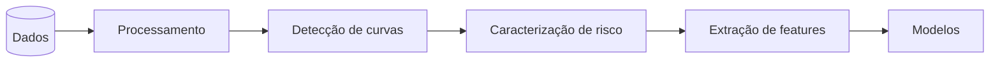

<p align="center">
  
</p>

<p align="center">
  
  
  
  
  
  <a href="https://huggingface.co/datasets/jwsouza13/routes_ML_inmetro">
    
  </a>
</p>

Queremos prever, momentos antes de o motorista entrar numa curva, se ele realizará uma condução segura ou de risco, a partir de dados de sensores veiculares OBD Link anteriores à curva.

## Instalação e execução
Clone este repositório:

```bash
git clone https://github.com/josewilsonsouza/curvant-ml.git
cd curvant-ml
```
Instalando:

```powershell
pip install -e .
```

Execute a limpeza dos dados, fazendo

```bash
cvt --preprocess
```

Implementamos algumas variáveis que são de interesse prever antes de entrar na curva. As flags de predição abaixo escolhem o que prever; cada uma escreve seus resultados em `results/<flag>/`. Sem flag, `cvt` mostra a ajuda.

```bash
cvt --risk           # previsão de Segura/Risco
cvt --velocity       # prevê a velocidade crítica e calcula o ISL
```

Outros comandos úteis são:

```bash
cvt --velocity --rebuild     # ignora o cache e reprocessa os dados
cvt --velocity --no-plot     # pula geração de gráficos
```
> [!TIP]
> Use `--rebuild` ao mudar parâmetros de detecção de curvas (`config.yaml`) ou de extração de features (`features.yaml > extracao`).

A mudança de parâmetros das configurações podem ser feitas no **`config.yaml`** e, para o gerenciamento das features, o arquivo **`features.yaml`**. A lista completa de targets e features está em **[TARGETS_E_FEATURES](docs/TARGETS_E_FEATURES.md)**.
## Pipeline

O projeto segue o seguite pipeline.



As features saem de uma janela espacial logo antes da curva (`precurva_distancia`). O tamanho é fixo ou dinâmico pela distância de frenagem ideal,  `[precurva_distancia_min, precurva_distancia_max]`. A janela termina `lead_gap` metros **antes** da entrada (predição antecipada) e exclui pontos de uma curva anterior.

### Caracterização de risco

Para cada segmento contíguo de `curva=True`, três critérios independentes geram os rótulos:

| Critério | Definição |
|---|---|
| Limite de aderência| $\max_t \sqrt{a_x^2 + a_y^2} > \alpha\,\mu\,g$ |
| Aceleração lateral | $\max_t \lvert a_y \rvert > 2 $ e curva DNIT $\ge$ aberta |
| Zigue-zague | $\ge 3$ mudanças de bearing alternadas com aceleração centrípeta |

`manobra_combinado_curva` é o OR dos três. Detalhes desses critérios estão em [RISK_MEASURES](docs/RISK_MEASURES.md).

### Modelos

- **Tabular** (`--risk`): 
  - Logistic Regression
  - Decision Tree
  - Random Forest
  - XGBoost
  - SVM
  - MLP
- **Temporal** (`--velocity`): operam sobre a sequência bruta da janela pré-curva
  - Regressão Linear
  - Random Forest
  - XGBoost
  - MLP
  - Long Short-Term Memory (LSTM)
  - Gated Recurrent Unit (GRU)
  - Rede Neural Convolucional (CNN)

## Dados
Os dados utilizados no projeto foram coletadas em diversos cenários, os datasets brutos estão no repositório HuggingFace: [`jwsouza13/routes_ML_inmetro`](https://huggingface.co/datasets/jwsouza13/routes_ML_inmetro). Os dados foram coletados pela equipe Lainf do Inmetro.

| Conjunto | Veículo | Trecho | Local |
|---|---|---|---|
| ELETRONUCLEAR | Spin / Van | Rio de Janeiro | `eletronuclear` |
| RJ-DF | Nivus | Rio de Janeiro -> Brasília | `rjdf` |
| SERRA | Jetta | trecho serrano | `serra` |
| RJMGBA / JANEIRO | - | rotas adicionais | `rjmgba`, `janeiro` |