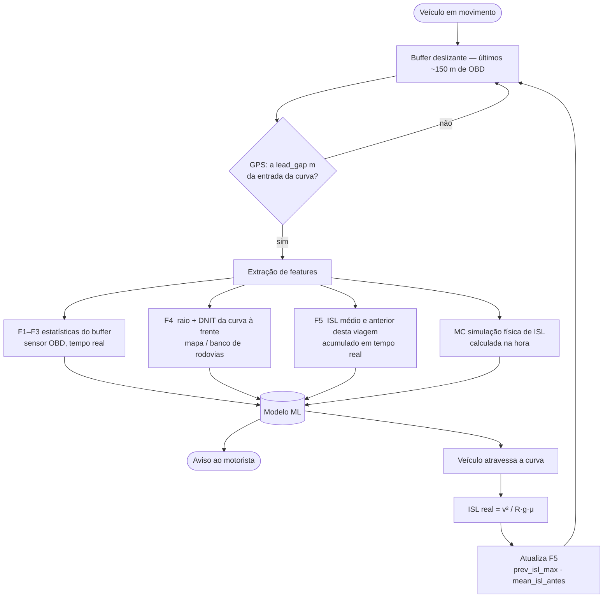

# Targets e Features

A ideia é prever, antes do carro entrar numa curva, o quão arriscada ela vai ser.
Para isso, cada curva vira uma linha de uma tabela, com dois tipos de coluna:

- **Target** (o que queremos prever): por exemplo, a velocidade no ponto mais crítico da curva, ou a classe de risco.
- **Feature** (o que usamos para prever): por exemplo, a velocidade média na aproximação, o raio da curva à frente.

Outro conceito importante é:

- **Janela pré-curva:** é o trecho do percurso **antes** da curva. Todas as features saem daí, porque a previsão é feita antes de chegar na curva. A janela termina um pouco antes da  entrada (uma folga, o `lead_gap`, hoje 30 m), simulando um sistema que avisa o motorista com antecedência.

**Não confundir as duas "janelas" do projeto.** Têm finalidades diferentes:

| Parâmetro | Onde (config) | Para quê | Unidade (default) |
|---|---|---|---|
| `lead_gap` | `features` | folga de antecipação: a janela de **features** termina `lead_gap` metros **antes** da entrada da curva | metros (30) |
| `janela_distancia` | `features` | **tamanho** da janela de features pré-curva | metros (dinâmico) |

O **target** é avaliado estritamente dentro da curva (sem incluir segundos de aproximação). A janela de **features** fica toda antes da entrada, terminando `lead_gap` metros antes — garantindo que o modelo não vê nada da curva no momento da predição.

## 1. O que cada comando prevê

Cada flag do `run.py` treina um alvo diferente (sem flag, mostra a ajuda):

| Comando | O que prevê | Tipo |
|---|---|---|
| `--risco` (com `--otimizar` usa Optuna) | curva é **Segura ou de Risco** (`manobra_combinado_curva`) | sim/não |
| `--importancia` | mesma coisa, mas só mostra **quais features pesam mais** | — |
| `--isl` | a **classe de risco ISL** (baixo / médio / alto) + baseline físico | 3 classes |
| `--aceleracao` | o **pico de aceleração dentro da curva** | número |
| `--multitarefa` | o **ISL máximo** + as 4 colunas de manobra, tudo de uma vez | misto |
| `--velocidade` | a **velocidade crítica** da curva (`v_critica`) | número |

> **Direção atual do projeto:** o caminho mais promissor é o `--velocidade` — prever a
> **velocidade crítica** e, a partir dela, calcular o ISL pela fórmula da física. É onde o
> modelo de fato supera um chute simples (ver Seção 6).

## 2. Targets

Todos são medidos **dentro da curva**, então nunca são usados como features.

### 2.1 Alvos realmente treinados por algum comando

| Coluna | O que é, em palavras simples |
|---|---|
| `manobra_combinado_curva` | A curva foi de **Risco** (1) ou **Segura** (0). É "sim se qualquer um dos 3 critérios de risco disparou". |
| `manobra_accel_curva` | Disparou o critério do limite de aderência do pneu (círculo de Kamm): a aceleração total passou de uma fração do que o pneu aguenta. |
| `manobra_lateral_curva` | Houve **aceleração lateral alta** numa curva fechada o bastante. |
| `manobra_ziguezague_curva` | Houve **zigue-zague** (mudanças de direção repetidas com aceleração lateral). |
| `isl_class` | A classe de risco ISL: **baixo, médio ou alto**. |
| `isl_max` | O **maior ISL** atingido na curva. ISL = v² / (R·g·μ): quanto a curva chegou perto do limite de derrapagem. |
| `curve_accel_y_max` | O **pico de aceleração lateral** (g lateral) dentro da curva. |
| `curve_abs_accel_max` | O **pico de aceleração total** dentro da curva. |
| `v_critica` | A **velocidade (km/h) no ponto de maior risco** da curva. Este é o alvo do `--velocidade`. |

### 2.2 Targets Opcionais

Estão calculados e prontos, mas nenhum comando os usa por enquanto. Para treinar um deles,
basta apontá-lo como alvo (ex.: `temporais.target` no `config.yaml`).

| Coluna | O que é |
|---|---|
| `manobra` | Mesmo que `manobra_combinado_curva` (nome antigo, mantido por compatibilidade). |
| `isl_mean` | ISL **médio** da curva (em vez do máximo). |
| `isl_alto` | Sinal de sim/não: o ISL passou de 0,8? |
| `isl_sensor_max` / `_mean` / `_class` | Uma versão do ISL calculada pelo **acelerômetro** (\|accel_y\|/g·μ) em vez do raio do GPS. Não depende do raio, então não sofre com ruído de GPS. |
| `curve_accel_y_mean` / `curve_abs_accel_mean` | As **médias** das acelerações (os treinados são os picos `_max`). |

## 3. As features

Estão organizadas em grupos. Todas vêm da janela pré-curva ou de algo que já se conhece de antemão (como a geometria da estrada à frente, porque a rota é conhecida). Nenhuma é medida dentro da curva.

### Grupo 1 - Sensores OBD (27 colunas)
As estatísticas básicas dos sensores na janela antes da curva. Para `vehicle_speed`, `accel_x` e `accel_y`, calculamos 9 estatísticas cada:

`_mean` (média), `_std` (desvio), `_median` (mediana), `_max`, `_min`, `_slope` (tendência: está acelerando ou freando?), `_cv` (variação relativa), `_mean_tarde` e `_slope_tarde` (os mesmos, mas só na metade final da janela).

> O `engine_rpm` está desligado no `config.yaml` (`features.vars_sensor`), então não há colunas de RPM.

### Grupo 2 - Dinâmica derivada da aproximação (11 colunas)
- `jerk_x_max`, `jerk_x_std`, `jerk_y_max`, `jerk_y_std`: o jerk é a variação brusca da aceleração.
- `n_perigo_accel_janela`, `n_perigo_lateral_janela`: quantas vezes a aceleração passou de um limite na janela.
- `janela_abs_accel_max`: máximo de √(aₓ²+a_y²) na janela pré-curva — análogo direto do critério de Kamm (que verifica o máximo do vetor de aceleração total dentro da curva).
- `distance_car_curve`: o comprimento da janela pré-curva (a distância coberta pela aproximação). ⚠️ **Não é** a distância até a curva, veja a nota abaixo.
- `janela_bearing_std`: desvio padrão das variações de bearing (Δθ) na janela pré-curva — mede o quanto o motorista já estava oscilando de direção antes da curva.
- `janela_bearing_range`: amplitude total do bearing na janela (max − min) — mede a extensão angular da trajetória de aproximação.
- `janela_n_mudancas_dir`: contagem de alternâncias de sinal de Δbearing (|Δθ| > 15°) na janela — precursor direto do critério de zigue-zague.

> A variável `distance_car_curve` é o tamanho da janela, em `m` de aproximação. A distância da ponta da janela até a entrada da curva é fixa e vale `lead_gap`  (**30 m** default). Só no `--velocidade` existe uma variável que mede a distância que falta para a curva a cada instante: `distancia_restante` (ver Seção 4).

### Grupo 3 - Geometria da janela pré-curva (3 colunas)
`janela_raio_min`, `janela_raio_mean`, `janela_raio_last`: o raio da pista durante a aproximação, pois mede o quanto a estrada já estava curvando antes da curva-alvo.

### Grupo 4 - Geometria da curva à frente (3 colunas)
`f4_raio_min`, `f4_raio_mean`, `f4_dnit_num`: o raio real da curva que vem pela frente e a sua classe oficial (seguindo o DNIT). Isso sob a suposição de que a rota é conhecida de antemão.

### Grupo 5 - Contexto das curvas anteriores (5 colunas)
Olham para o histórico do trajeto até aqui, usando só as curvas **anteriores**: `n_curvas_antes`,
`prev_isl_max` (ISL da curva imediatamente anterior), `mean_isl_antes` (ISL médio de todas as
curvas anteriores), `prev_raio_min`, `prev_raio_mean`, `prev_dnit_num` (geometria da curva
imediatamente anterior).

> O ISL é calculado de `v²/(R·g·μ)` — medido pelos sensores durante cada curva, disponível em
> tempo real sem depender de rótulos do modelo. Versões anteriores usavam `prop_perigosas_antes`
> (fração de curvas com rótulo Risco), que introduzia dependência do ground truth das curvas
> anteriores na avaliação.

### Grupo 6 - Monte Carlo (3 colunas)
`mc_p_baixo`, `mc_p_medio`, `mc_p_alto`: uma simulação que, a partir da velocidade na aproximação e do raio da curva, estima a probabilidade de cada classe de ISL. Na prática é um "chute físico" embutido como feature, e que também foi usado para comparar com o modelo.

## 4. O comando `--velocidade` usa um conjunto de features diferente

O `--velocidade` **não** usa as 49 features acima. Ele trabalha com a **sequência no tempo** dos sensores. Ou seja, a série inteira da aproximação, não só as estatísticas resumidas. Ele usa:

- **Sensores ao longo do tempo** (50 instantes): `vehicle_speed`, `accel_x`, `accel_y`,  `engine_rpm` + o canal **`distancia_restante`**, que é a **distância que falta para a entrada da curva** em cada instante (decresce até zero na entrada, normalizada para [0, 1]).
- **Alguns números fixos por curva**: `jerk_y_max`, as contagens de perigo, a geometria da curva à frente, as probabilidades de Monte Carlo, e o contexto (`mean_isl_antes`, `prev_isl_max`, `n_curvas_antes`).
- **A resposta da curva anterior** (`prev_v_critica`): usa o valor da velocidade critica da curva passada como pista.

Para mudar as features usadas pela flag `--velocidade`, edite `temporais.sensors` e `.scalares_extras` no [config.yaml](../config.yaml).

## 5. Colunas que ficam DE FORA das features (e por quê)

| Por quê | Quantas | Quais |
|---|---|---|
| **Identificador** | 4 | `id_route`, `id_trecho_curvo`, `time_inicio`, `time_fim` |
| **Medido dentro da curva** | 3 | `curve_raio_min`, `curve_raio_mean`, `curve_dnit_num` |

**Como adicionar uma feature nova:** se ela for honesta (sai da janela pré-curva ou é geometria conhecida de antemão), basta criá-la no [curvant/driving/features.py](../curvant/driving/features.py) e 
ela já entra como feature automaticamente. Se ela for medida na ou depois da entrada da curva, registre o nome dela na lista `NAO_FEATURES` em `curvant/driving/features.py`, senão ela vira "cola".

## 6. Avisos importantes

- **A previsão é antecipada.** A janela pré-curva termina 30 m **antes** da entrada
  (`config.features.lead_gap`). Nada medido na entrada ou dentro da curva pode ser feature.

- **O projeto compara o modelo com um "chute simples".** Sob `--isl` e `--velocidade` o pipeline mostra,
  ao lado do modelo, o resultado de uma referência sem aprendizado (a simulação de Monte Carlo,
  ou "a velocidade na curva ≈ a velocidade de aproximação"). Isso mede **o quanto o modelo
  realmente acrescenta**. Conclusão até agora: para a classe de ISL o ganho é pequeno (a
  física já acerta quase tudo), mas para a **velocidade crítica** o modelo ganha bastante
  (erro cai de ~11 para ~7 km/h).

- **O Grupo 4 (F4) exige mapa ou rota conhecida.** As features `f4_raio_min`, `f4_raio_mean` e `f4_dnit_num` descrevem a geometria da curva *à frente*, medida pelo GPS durante a gravação. Em implantação real, esses valores precisariam vir de um banco de dados de rodovias ou de um mapa (ex.: OpenStreetMap), não do sensor em tempo real. Isso é razoável para um sistema embarcado com mapa, mas deve ser explicitado ao comparar com sistemas puramente baseados em sensores.

- **Por que `v_critica`** Como ISL = v² / (R·g·μ) e o raio R é conhecido de antemão, prever o ISL com R conhecido é basicamente prever a velocidade na curva. Então faz  mais sentido prever a velocidade direto e calcular o ISL pela fórmula.

## 7. Como o sistema funcionaria em produção

O fluxo de predição ocorre **antes de o veículo entrar em cada curva**:

**O contexto F5 é atualizado de forma sequencial:** cada curva percorrida alimenta o histórico
da próxima. Neste dataset isso é reconstruído da mesma forma (shift + expanding mean por
id_route), o que o torna diretamente análogo ao comportamento em produção.

**F4 requer mapa.** Em produção, `f4_raio_min`, `f4_raio_mean` e `f4_dnit_num` viriam de um
banco de dados de rodovias (ex.: OpenStreetMap, cadastro DNIT), não do sensor em tempo real —
porque no momento da predição o veículo ainda não entrou na curva. O split por rota não cria
leakage por causa do F4: a geometria do mapa seria conhecida em qualquer cenário.

**O fluxo é o mesmo para todas as flags** (`--risco`, `--isl`, `--aceleracao`, `--multitarefa`),
com uma diferença no `--velocidade`: em vez de estatísticas agregadas (F1–F3), o modelo recebe
a sequência bruta dos sensores reamostrada para `n_timesteps` instantes uniformes.
